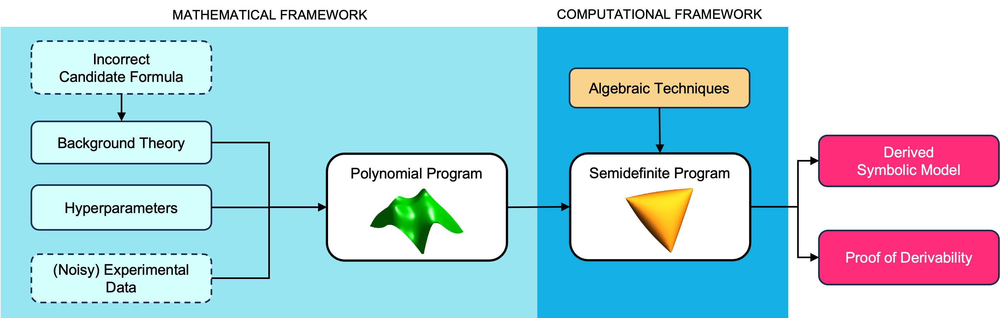

[](https://GitHub.com/IBM/AI-Hilbert/tags/)
[](https://zenodo.org/badge/latestdoi/791611893)
[](https://opensource.org/licenses/MIT)

# AI-Hilbert
This repository contains the code and the data used for the experiments in the paper [Evolving Scientific Discovery by Unifying Data and
Background Knowledge with AI Hilbert](https://nature.com/articles/s41467-024-50074-w) published in Nature Communications.


AI Hilbert is an algebraic geometric based discovery system (based on Putinar's Positivstellensatz), that enables the discovery of fundamental laws of nature (or non-physical systems) based on knowledge (articulated in formal logic terms) and experimental data.

**Visit our website** for a general overview, references, and some introductory videos: &rarr; [AI-Hilbert website](https://ai-hilbert.github.io) &larr;

<p align="center">  </p> 


## Code

The code is organized in 3 folders. One containing the problems studied in the main paper, one containing the problems studied in the paper appendix and one for data generation.

The folder `main_problems` contains:
* A notebook for the **Hagen-Poissuille Equation**, **Einstein’s Relativistic Time Dilation Law** and **Kepler’s Third Law of Planetary Motion**: [hagen_einstein_kepler[3.3][3.5][3.6].ipynb](main_problems/hagen_einstein_kepler[3.3][3.5][3.6].ipynb)
* A folder for the **revisited** problem of deriving **Kepler’s third law of planetary motion** from an incomplete background theory [kepler_with_missing_axioms[3.7]](main_problems/kepler_with_missing_axioms[3.7]) containing:
  * the corresponding notebook [kepler_with_missing_axioms[3.7].ipynb](main_problems/kepler_with_missing_axioms[3.7]/kepler_with_missing_axioms[3.7].ipynb)
  * the data used [data_kepler.dat](main_problems/kepler_with_missing_axioms[3.7]/data_kepler.dat), [data_kepler_d.dat](main_problems/kepler_with_missing_axioms[3.7]/data_kepler_d.dat), and [data_kepler_n_points.dat](main_problems/kepler_with_missing_axioms[3.7]/data_kepler_n_points.dat).
* A notebook for the **Radiated Gravitational Wave Power Equation**: [grav_waves[3.4].ipynb](main_problems/grav_waves[3.4].ipynb)
* A notebook for the **Bell Inequalities**: [bell_inequalities[3.8].ipynb](main_problems/bell_inequalities[3.8].ipynb)

The folder `suppl_material_problems` contains a notebook for each of the following problems:
* 6 problems from FSRD ([Feynman Symbolic Regression Database](https://space.mit.edu/home/tegmark/aifeynman.html) based on ["The Feynman Lectures on Physics"](https://www.feynmanlectures.caltech.edu)):
  * **I.15.10 FSRD**: [I_15_10.ipynb](suppl_material_problems/I_15_10.ipynb)
  * **I.27.6 FSRD**: [I_27_6.ipynb](suppl_material_problems/I_15_10.ipynb)
  * **I.34.8 FSRD**: [I_34_8.ipynb](suppl_material_problems/I_15_10.ipynb)
  * **I.43.16 FSRD**: [I_43_16.ipynb](suppl_material_problems/I_15_10.ipynb)
  * **II.10.9 FSRD**: [II_10_9.ipynb](suppl_material_problems/I_15_10.ipynb)
  * **II.34.2 FSRD**: [II_34_2.ipynb](suppl_material_problems/I_15_10.ipynb)
* 6 additional problems:
  * **Inelastic Relativistic Collision**: [inelastic.ipynb](suppl_material_problems/inelastic.ipynb)
  * **Decay of Pion into Muon and Neutrino**: [decay.ipynb](suppl_material_problems/decay.ipynb)
  * **Radiation Damping and Light Scattering**: [light.ipynb](suppl_material_problems/light.ipynb)
  * **Escape Velocity**: [escape.ipynb](suppl_material_problems/escape.ipynb)
  * **Hall Effect**: [hall.ipynb](suppl_material_problems/hall.ipynb)
  * **Compton Scattering**: [compton.ipynb](suppl_material_problems/compton.ipynb)

The folder `data_generation` contains:
* A python file for generating the data for the Kepler problem [data_gen_kepler.py](data_generation/data_gen_kepler.py)
* A python file [data_gen_mix.py](data_generation/data_gen_mix.py) for generating the data for the following problems:
  *  Inelastic Relativistic Collision
  *  Decay of Pion into Muon and Neutrino
  *  Radiation Damping and Light Scattering
  *  Escape Velocity
  *  Hall Effect
  *  Compton Scattering
  *  Radiation Gravitational Wave Power
  *  Hagen Poiseuille equation

## How to cite

```
@article{AI_Hilbert,
    title={Evolving scientific discovery by unifying data and background knowledge with AI Hilbert}, 
    author={Ryan Cory-Wright and Cristina Cornelio and Sanjeeb Dash and Bachir El Khadir and Lior Horesh},
	   volume = {15},
	   url = {https://doi.org/10.1038/s41467-024-50074-w},
	   doi = {10.1038/s41467-024-50074-w},
	   journal = {Nature Communications},
	   month = jul,
	   year = {2024},
	   pages = {5922},
}
```
